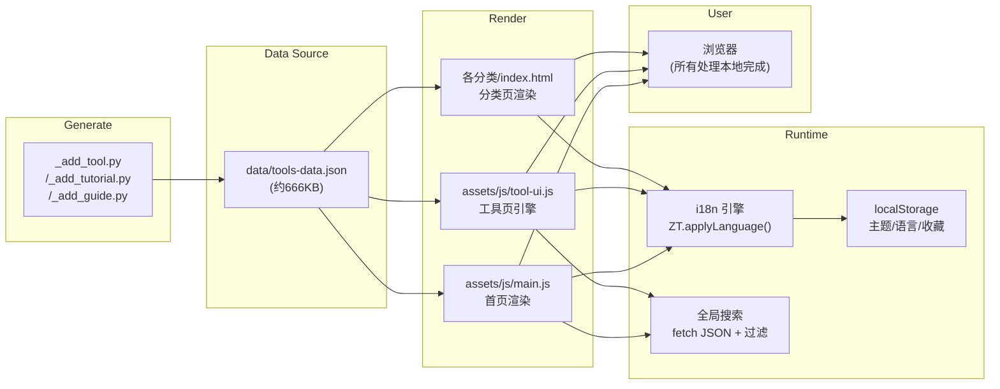
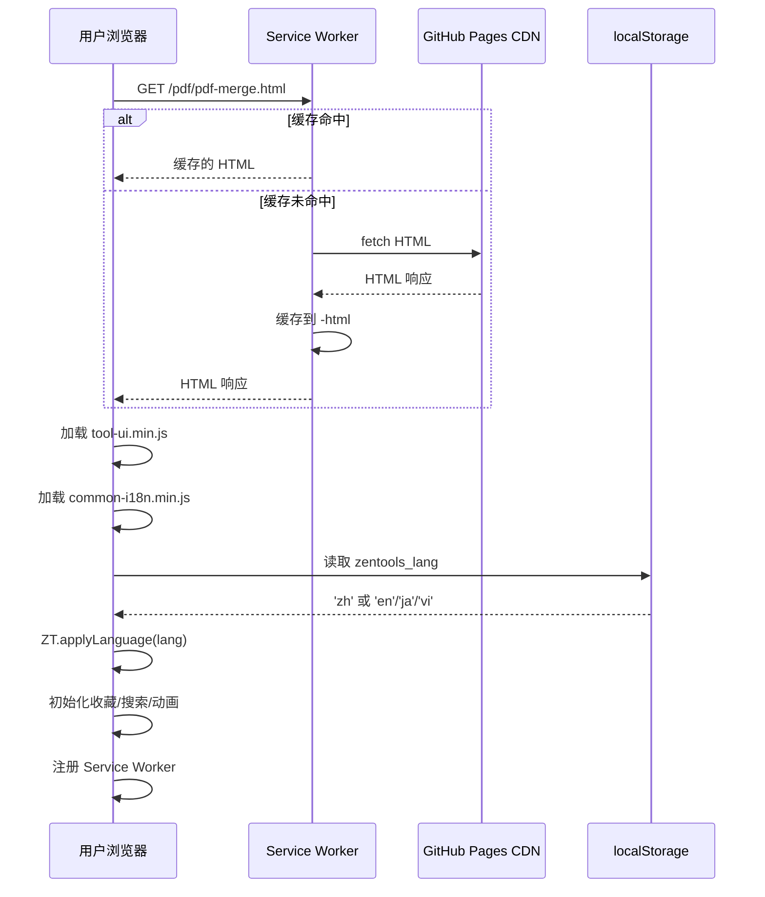

# ZenTools 系统架构文档

## 概述

ZenTools 是一个免费在线工具箱网站，提供 300+ 款纯前端工具，覆盖 PDF 处理、图片编辑、AI 写作、音视频转换、文本处理、SEO 分析、生活计算器、金融工具等领域。站点为纯静态 HTML5 + CSS3 + Vanilla JavaScript 架构，无任何框架依赖，通过 GitHub Pages 从 main 分支根目录直接部署。

系统采用 **数据驱动分类架构（ZT-DCA）**，将工具元数据统一存储在 `data/tools-data.json` 中，首页、分类页、搜索页均从同一数据源动态渲染，避免多处重复维护工具列表。支持 zh/en/ja/vi 四语言国际化，所有工具在浏览器本地运行，文件不上传服务器。

## 技术栈

**语言与运行时**
- HTML5（W3C 标准语义化标签）
- CSS3（CSS 变量、Grid、Flexbox、backdrop-filter）
- Vanilla JavaScript（ES6+，无 jQuery/React/Vue 等框架）
- Python 3（CLI 辅助脚本：工具生成、站点地图、JSON 校验）

**数据存储**
- JSON 文件（`data/tools-data.json`，约 666KB，包含全部工具元数据）
- localStorage（用户偏好：语言、主题、收藏、最近使用、页面浏览统计）
- Service Worker Cache API（PWA 离线缓存）

**基础设施**
- GitHub Pages（静态托管，main 分支根目录）
- Google Analytics 4（站点统计，测量 ID: `G-V3MP20S9Z3`）
- Google AdSense（广告展示，发布商 ID: `ca-pub-1955887568822472`）
- Cloudflare DNS（域名 zentools.xyz）

**PWA 能力**
- Service Worker（`sw.js`，cache-first 策略，5 个缓存分层）
- Web App Manifest（`manifest.json`，standalone 模式，自定义图标和快捷方式）

## 项目结构

```
ZenTools/
├── index.html                 # 首页：Hero → 搜索 → 热门工具 → 分类 → 教程入口 → Footer
├── tools.html                 # 全局工具搜索与列表页
├── categories.html            # 分类总览页
├── about.html                 # 关于页面
├── contact.html               # 联系页面
├── privacy.html               # 隐私政策
├── terms.html                 # 使用条款
├── changelog.html             # 更新日志
├── notes.html                 # 学习笔记
├── examples.html              # 示例页面
├── recovery-console.html      # 防崩恢复控制台
│
├── data/
│   ├── tools-data.json        # 工具元数据主数据源（约 13,000 行）
│   ├── tools.json             # 备用简化工具列表
│   ├── categories.json        # 分类数据
│   ├── translations.json      # 翻译文件
│   └── site-info.json         # 站点信息
│
├── assets/
│   ├── css/
│   │   ├── tool-ui.css        # 全局 UI 样式（CSS 变量、导航、卡片、页脚）
│   │   ├── tool-ui.min.css    # 压缩版
│   │   ├── style.css          # 辅助样式
│   │   └── style.min.css      # 压缩版
│   └── js/
│       ├── tool-ui.js         # 全局 JS 引擎（i18n、主题、搜索、收藏、统计）
│       ├── tool-ui.min.js     # 压缩版
│       ├── common-i18n.js     # 公共翻译数据
│       ├── common-i18n.min.js # 压缩版
│       ├── main.js            # 首页渲染逻辑
│       ├── anti-crash.js      # 防崩引擎（错误捕获、JSON 校验、备用模式）
│       ├── anti-crash.min.js  # 压缩版
│       └── tools-data.js      # JS 版工具数据（由 _sync_tools_data_js.py 同步）
│
├── pdf/                       # PDF 工具（47 个工具页面 + index.html）
├── image/                     # 图片工具（58 个工具页面 + index.html）
├── text/                      # 文本工具（12 个工具页面 + index.html）
├── dev/                       # 开发工具（21 个工具页面 + index.html）
├── audio/                     # 音频工具（11 个工具页面 + index.html）
├── video/                     # 视频工具（19 个工具页面 + index.html）
├── ai/                        # AI 工具（39 个工具页面 + index.html）
├── seo/                       # SEO 工具（15 个工具页面 + index.html）
├── life/                      # 生活工具（43 个工具页面 + index.html）
├── finance/                   # 金融工具（11 个工具页面 + index.html）
├── json/                      # JSON 工具
├── qr/                        # QR 码工具
│
├── tutorials/                 # 教程页面（360 篇，含工具教程 + 对比评测）
├── guides/                    # 深度指南页面（28 篇，含 AI 工具评测、工作流指南）
├── compare/                   # 工具对比首页
│
├── _add_tool.py               # 工具页面生成器（HTML + JSON + sitemap）
├── _add_tutorial.py           # 教程页面生成器
├── _add_guide.py              # 指南页面生成器
├── _gen_sitemap.py            # 站点地图生成器
├── _gen_tutorials.py          # 教程批量生成
├── _check_json.py             # JSON 数据校验
├── _sync_tools_data_js.py     # JSON → JS 数据同步
├── _minify_assets.py          # JS/CSS 资源压缩
├── _opt_index.py              # 首页优化
├── _check_paths.py            # 路径校验
│
├── sw.js                      # PWA Service Worker
├── manifest.json              # PWA Manifest
├── robots.txt                 # 搜索引擎爬虫规则
├── sitemap.xml                # 站点地图（710 个 URL）
├── favicon.svg                # 网站图标
├── icon-192x192.png           # PWA 小图标
├── icon-512x512.png           # PWA 大图标
│
└── .github/workflows/backup.yml  # CI 备份工作流
```

**入口点**
- `index.html` — 用户入口，网站首页
- `tools.html` — 全局工具搜索与列表
- `pdf/pdf-merge.html` — 典型工具页面示例
- `assets/js/tool-ui.js` — 全局 JS 引擎初始化

## 子系统

### 1. 数据层（Data Layer）

**目的**: 集中管理所有工具元数据，驱动首页、分类页和搜索页的渲染。
**位置**: `data/`
**关键文件**: `tools-data.json`（约 13,000 行）、`tools.json`、`categories.json`
**依赖**: 无外部依赖
**被依赖**: `main.js`、`tool-ui.js`、分类首页、工具页面

`tools-data.json` 结构：
```json
{
  "version": "2.2",
  "categories": ["AI工具", "图片工具", "PDF工具", ...],
  "tools": [{
    "name": "PDF 合并",
    "name__en": "PDF Merge",
    "name__ja": "PDF 結合",
    "name__vi": "Gộp PDF",
    "slug": "pdf-merge",
    "category": "PDF工具",
    "url": "/pdf/pdf-merge.html",
    "description": "...",
    "icon": "📄",
    "featured": true,
    "keywords": "pdf 合并 合并pdf",
    "ai": { "free": true, "registration": false, ... }
  }, ...]
}
```

### 2. UI 层（UI Layer）

**目的**: 提供统一的设计系统、导航栏、卡片样式和响应式布局。
**位置**: `assets/css/tool-ui.css`、`assets/css/style.css`
**关键文件**: `tool-ui.css`（全局样式，313 行）、`tool-ui.min.css`
**依赖**: 无
**被依赖**: 所有 HTML 页面

CSS 变量体系：
```css
--bg:      #06070d;   /* 深色背景 */
--glass:   rgba(255,255,255,0.04);  /* 毛玻璃面板 */
--cyan:    #00e5ff;   /* 主色调 */
--purple:  #a855f7;   /* 辅助色调 */
--pink:    #f43f5e;   /* 强调色 */
--text:    #f0f4ff;   /* 主文字 */
--muted:   #6b7a9f;   /* 辅助文字 */
--border:  rgba(255,255,255,0.07);  /* 边框 */
```

### 3. 国际化引擎（i18n Engine）

**目的**: 运行时切换 zh/en/ja/vi 四种语言，无需重新加载页面。
**位置**: `assets/js/common-i18n.js`（公共翻译）、`assets/js/tool-ui.js` 中的 `ZT.applyLanguage()`
**关键文件**: `common-i18n.js`（86 行）、`tool-ui.js`（601 行）
**依赖**: `window.ZT_COMMON`（公共翻译）、`window.ZT_PAGE`（页面专属翻译）
**被依赖**: 所有页面

翻译合并策略：`window.ZT_PAGE[key]` 覆盖 `window.ZT_COMMON[key]`（页面级优先）。语言切换通过 `zt-langchange` 自定义事件触发生效。

### 4. JavaScript 引擎（JS Engine）

**目的**: 提供全局功能：主题切换、搜索、收藏、最近使用、工具跳转推荐、滚动动画。
**位置**: `assets/js/tool-ui.js`
**关键文件**: `tool-ui.js`（601 行）、`main.js`（227 行）
**依赖**: `common-i18n.js`、`tools-data.json`
**被依赖**: 所有页面

`tool-ui.js` 加载时自动初始化的功能：
- 暗色/亮色主题切换按钮（直接注入 DOM）
- 回到顶部按钮（直接注入 DOM）
- IntersectionObserver 滚动渐入动画
- 浮动光晕动画（`blob-1`/`blob-2`）
- 全局导航搜索（注入到 `.nav-inner`）
- 收藏（★/☆）按钮（注入到 `.page-header`）
- 最近使用记录（localStorage）
- 互补工具推荐（`relatedMap`）
- Service Worker 注册

### 5. 防崩引擎（Anti-Crash Engine）

**目的**: 捕获全局异常，自动切换备用模式，保护用户体验。
**位置**: `assets/js/anti-crash.js`
**关键文件**: `anti-crash.js`（464 行）、`anti-crash.min.js`
**依赖**: 无
**被依赖**: 在 `<head>` 中最先加载

防御机制：
- 全局 `onerror` 和 `unhandledrejection` 捕获
- JSON 自动校验（拦截 fetch/XMLHttpRequest）
- 连续 5 个错误自动切备用模式（`zt_fallback_active`）
- 每 30s 健康检查关键 DOM 元素
- localStorage 备份与恢复
- 恢复控制台 API（`recovery-console.html`）

### 6. PWA 层（PWA Layer）

**目的**: 提供离线访问能力和类原生应用体验。
**位置**: `sw.js`、`manifest.json`
**关键文件**: `sw.js`（187 行，cache-first 策略）

5 层缓存体系：
| 缓存 | 内容 | 策略 |
|------|------|------|
| `-core` | 首页、tools.html、manifest、图标 | 安装时预缓存 |
| `-assets` | CSS/JS 静态资源 | 安装时预缓存 |
| `-data` | tools-data.json | 安装时预缓存 |
| `-html` | 工具页面 | 运行时动态缓存 |
| `-pages` | 分类首页 | 安装时预缓存部分 + 运行时追加 |

### 7. 辅助脚本层（Tooling Scripts）

**目的**: 自动化工具页面/教程/指南生成、站点地图维护、JSON 校验、资源压缩。
**位置**: 项目根目录 `_*.py` 脚本
**关键文件**:
- `_add_tool.py` — 生成新工具 HTML 页面骨架 + 更新 `tools-data.json`
- `_gen_sitemap.py` — 遍历所有 `.html` 文件生成 `sitemap.xml`
- `_check_json.py` — 校验 `tools-data.json` 格式完整性
- `_sync_tools_data_js.py` — 将 `tools-data.json` 同步为 `tools-data.js`
- `_minify_assets.py` — 压缩 JS/CSS 资源

## 数据流



## 请求流程（以工具页为例）



## 部署架构

```
GitHub Repository (main branch)
    │
    ├── GitHub Actions (.github/workflows/backup.yml)
    │   └── 每次 push + 每日 00:00 UTC 备份数据/配置/核心脚本
    │
    └── GitHub Pages
        ├── HTTPS: https://zentools.xyz
        ├── 自定义域名 (CNAME → zentools.xyz)
        └── Cloudflare DNS 代理
```
